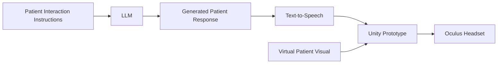

# Patient Simulation Prototype

## Overview

This project is an early-stage **AI-powered patient simulation prototype** created to explore how conversational AI and immersive technology could support nursing education.

The primary focus of this repository is an early **Unity/Oculus prototype** that explores how a virtual patient could eventually be presented in an immersive environment.

The project also incorporates **patient interaction instructions developed for a separate chat-based prototype**. The complete chat interface itself is **not included in this repository**.

The goal of the project was to experiment with different approaches for creating AI-supported simulated patient experiences for nursing education.

## Patient Interaction Instructions

This project uses patient interaction instructions developed while experimenting with a separate **chat-based AI patient simulation**.

These instructions were designed to guide an AI model in behaving like a simulated patient, including how the patient should:

* Respond to learner questions
* Provide relevant patient information
* Maintain the role of the simulated patient
* Support a clinical conversation without unnecessarily revealing information

The full Streamlit chat interface and associated application are maintained separately and are **not part of this repository**.

## Text-to-Speech

The project includes support for text-to-speech using **XTTS v2**, allowing generated patient responses to potentially be converted into speech.

Example configuration:

```yaml
tts:
  use_gpu: false
  model_name: 'tts_models/multilingual/multi-dataset/xtts_v2'
  speaker: 'Rosemary Okafor'
  language: 'en'
```

The configuration also supports optional streaming and voice settings.

## LLM Configuration

LLM settings can be configured locally using placeholders such as:

```yaml
llm:
  model: "YOUR_MODEL"
  api: "YOUR_API"
  api_key: "YOUR_KEY"
  system_message: "You are a helpful assistant."
  temperature: 0.7
  top_p: 0.9
```

Replace these values locally with the appropriate model and API service.

**Do not commit real API keys or private service credentials to the repository.**

## Unity / VR Exploration

A Unity-based prototype was created to explore how a simulated patient could eventually be presented in an immersive environment.

During this stage, a **virtual patient visual was successfully displayed through an Oculus headset**. This served as an initial proof of concept for presenting a virtual patient within VR.

The VR component is an **exploratory prototype** rather than a complete interactive nursing simulation. Full conversational interaction between the learner and the VR patient was not implemented in this prototype.

## Prototype Architecture



The diagram represents the overall prototype concept. The Unity/Oculus portion focused primarily on displaying the virtual patient, while the conversational interaction was explored separately.

## Technologies Explored

* Unity
* Oculus / Virtual Reality
* Python
* Large Language Models
* Conversational AI
* XTTS v2
* Text-to-Speech
* AI-assisted healthcare education

## Project Context

This project was developed during **Spring 2026 at UNC Charlotte** as part of an exploration of AI-supported nursing simulation.

The work focused on rapid prototyping and exploring how **AI-driven patient behavior, conversational interaction concepts, and immersive environments** could potentially be combined to support healthcare education.

This repository represents the **Unity/VR exploration and supporting AI interaction components**. A separate prototype was developed to explore the full chat-based patient interaction experience.

## Attribution

This project was adapted from the open-source [AI-Iris-Avatar](https://github.com/Scthe/ai-iris-avatar) project created by Marcin Matuszczyk (@Scthe).

The original project provides an AI-powered 3D avatar architecture using large language models (LLMs), text-to-speech (TTS), Unity, and Oculus LipSync.

For this project, components of the original framework were explored and adapted in the context of **AI-supported nursing simulation**, particularly for experimenting with presenting a virtual patient through an Oculus headset and exploring AI-driven patient interaction.

The original AI-Iris-Avatar project is licensed under the **GNU General Public License v3.0 (GPL-3.0)**. Please refer to the original repository and included license files for additional licensing and attribution requirements.

## Disclaimer

This project is an **educational and research prototype**.

It is not intended for clinical use, medical diagnosis, treatment recommendations, or real-world patient care.
